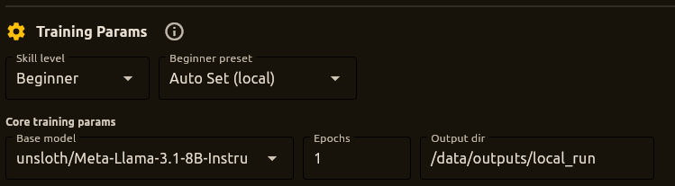

# Training Tab

The Training tab is where you fine-tune language models on your own data. You can train on Runpod's cloud GPUs or locally via Docker—the same training script works in both environments, so you can develop locally and scale up when you're ready.

## How Training Works

The basic flow is straightforward: choose where to train (Runpod or local), pick your dataset, configure hyperparameters, and start the run. If you're new to training, the beginner presets handle most of the complexity for you. If you know what you're doing, expert mode gives you full control.

After a successful local run, the Quick Local Inference panel appears so you can immediately test your adapter with a few prompts. And at any point, you can save your entire training setup as a configuration that you can reload later—the last config you used even auto-loads on startup.

______________________________________________________________________

## Choosing Where to Train

### Runpod (Cloud GPUs)

When you select Runpod as your training target, you're running on cloud GPUs. The tab shows infrastructure helpers to create network volumes and pod templates, GPU selection options, and controls to start training on a pod. Logs stream in real time so you can monitor progress.

### Local Docker

For local training, FineFoundry runs the training script inside a Docker container on your machine. You set which local folder to mount as `/data` in the container, choose whether to use your GPU, and optionally pass your HF token so push-to-hub works. The logs panel shows everything happening inside the container, and you can stop the run at any time.

## Dataset and Hyperparameters

Your dataset can come from a Database Session (any of your scrape history) or directly from Hugging Face. The output directory is where checkpoints and the final adapter get saved—it's a path inside the container that maps back to your real filesystem.

The hyperparameters section gives you control over the base model (defaulting to a 4-bit Llama 3.1 8B), epochs, learning rate, batch size, gradient accumulation, and max steps. Enable packing if your examples are short to improve throughput. Auto-resume lets you pick up from the latest checkpoint if training gets interrupted.

If you want to push your trained adapter to Hugging Face Hub, enable that option and provide your repo ID. Make sure your HF token has write permissions.

## Beginner Presets

In Beginner mode, you get presets that handle the complexity for you. For Runpod, choose between "Fastest" (optimized for throughput on good GPUs) or "Cheapest" (conservative settings for smaller GPUs). For local training, "Quick local test" does a short run for sanity checking, "Auto Set" reads your GPU specs and configures things aggressively but safely, and "Simple custom" gives you three intuitive sliders for duration, memory usage, and quality.

Expert mode hides the presets and exposes all hyperparameters directly for full control.

## Quick Local Inference

After a successful local training run, the Quick Local Inference panel appears. This is your instant demo station—you can immediately test your new adapter without leaving the tab.

The panel shows which adapter and base model you're using, and gives you controls for temperature, max tokens, and generation presets (Deterministic, Balanced, Creative). There's even a dropdown with sample prompts pulled from your training dataset so you can quickly verify the model learned what you intended.

Type a prompt and click Run Inference. The button disables while the model loads and generates, then your response appears in a scrollable list. You can clear history or export your conversation to a text file.

For more extensive testing with full chat history and multi-turn conversations, see the [Inference Tab](inference-tab.md).

## Saving and Loading Configurations

Training configurations capture your entire setup—training target, dataset, hyperparameters, skill level, and infrastructure settings. Click "Save current setup" to snapshot everything with a descriptive name. Configs are stored in the database and the last one you used auto-loads on startup.

To reload a config, pick it from the dropdown and click Load. The app switches to the right training target and populates all the fields. The dropdown filters configs by training target to avoid accidentally loading a Runpod config when you're in local mode.

______________________________________________________________________

## Step-by-Step: Training on Runpod

Select Runpod as your training target, then configure your dataset and hyperparameters. If you're new to this, use Beginner mode and pick either "Fastest" for maximum throughput or "Cheapest" for budget-friendly runs.

In the Runpod section, use the infrastructure helpers to create a network volume and pod template if you don't have them yet. Select your GPU type and region, then start training. Logs stream in real time so you can monitor progress. When training completes, you can optionally push your adapter to Hugging Face Hub.

## Step-by-Step: Training Locally

Select Local as your training target. For quick experiments, use Beginner mode with the "Quick local test" preset. For serious runs on your GPU, "Auto Set" reads your specs and configures things optimally.

Set your host data directory (this is where outputs will appear), enable GPU usage if you have a CUDA-capable card, and optionally pass your HF token to the container if you want to push results. Click Start Local Training and watch the logs. You can stop anytime if something looks wrong.

After a successful run, Quick Local Inference appears with your new adapter ready to test.

______________________________________________________________________

## Under the Hood

Both Runpod and local Docker training run the same `train.py` script inside an Unsloth-based trainer image. The stack includes PyTorch for training, Hugging Face Transformers for model loading, bitsandbytes for 4-bit quantization, and PEFT/LoRA via Unsloth for parameter-efficient fine-tuning.

The default base models are Unsloth-optimized variants of popular open models like Llama 3.1 8B. Adapters and checkpoints get written to your output directory and are picked up by Quick Local Inference and the Inference Tab.

## Tips

Start in Beginner mode until you've found stable hyperparameters for your use case. Use "Quick local test" for rapid experiments and "Auto Set" for your first real run on a new GPU. Once you have settings that work, save them as a config so you can reload and iterate.

Enable packing when your examples are short—it significantly improves throughput. And keep an eye on the logs for early signs of out-of-memory errors or dataset issues.

______________________________________________________________________

## Offline Mode

When Offline Mode is enabled, only local training works. Runpod is disabled, the training target is forced to Local, and Hugging Face datasets and Hub push are unavailable. If you were using a HF dataset, the UI resets to Database. A banner at the top of the tab explains what's disabled and why.

______________________________________________________________________

## Troubleshooting

If you run into problems, check the [Troubleshooting Guide](troubleshooting.md). Common issues include CUDA out-of-memory errors (exit code 137) for local Docker runs, HF authentication problems inside containers, and config-related mistakes that saved setups help avoid.

______________________________________________________________________

## Related Guides

For the overall workflow, see the [Quick Start Guide](quick-start.md). After training, use the [Inference Tab](inference-tab.md) for extensive testing with chat history. The [Merge Datasets Tab](merge-tab.md) helps combine multiple datasets, and the [Logging Guide](../development/logging.md) covers debugging training runs.

______________________________________________________________________

**Next**: [Merge Datasets Tab](merge-tab.md) | **Previous**: [Publish Tab](build-publish-tab.md) | [Back to Documentation Index](../README.md)
